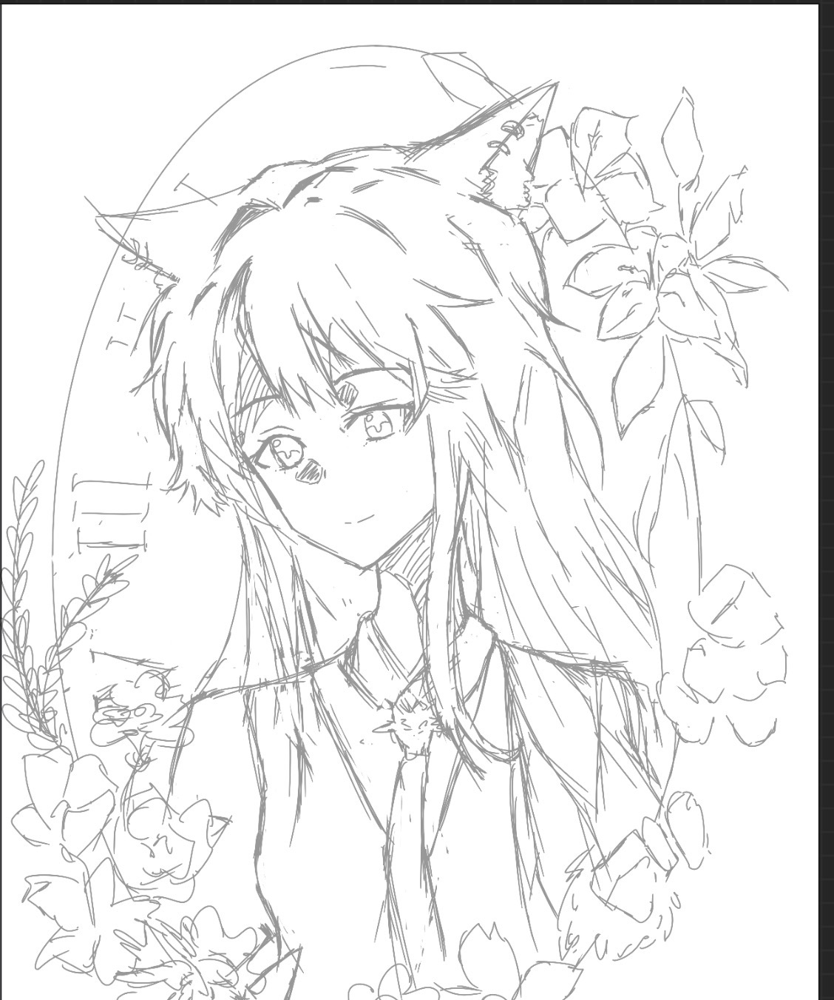

## 日常
今天早上特别困的从床上爬起来，比平时晚起了十五分钟左右，然后发现已经7点40了对象还没有醒！！？。然后打电话也打不通，他舍友也没有人回消息，在路上走发现都没有我们班的人，我就感觉不对劲，一看课表，今天根本没有早八！！受不了了然后回宿舍路上买了一杯拿铁还有早饭，回宿舍刷了1个小时抖音又去上课了。高数课下去买了凉皮吃！好香的！学校的凉皮还挺便宜的只要6块。中午没有午睡，因为吃完都一点了，马上两点又要去上课了……线代课在画画（制作美味同人中）。晚上的水课依旧画画，上完课吃的晚饭，点的紫燕百味鸡的外卖！好吃😋！
今天就摘录一下早上刷抖音看到的喜欢的文案吧！
>循此苦旅，以抵繁星。

>那些曾经出现在我生命中的人他们也会偶尔想起我吗？

>他们不再参与我的今天，可他们确实组成过我的昨天。

## 学习
今天基本没怎么学习，因为没有什么状态，一个是记错早八然后导致没什么精神，今天也没什么动力，想偷懒一下。不过高数课的时候在学习二重积分，学了将近两个小时才把定区域D的判断学会（不过学懂了又感觉找区域很简单！）。受不了了，感觉补起来好困难，因为这才是最基础的就花了这么久……
## 绘画
今天画了德克萨斯的线稿，感觉自己画的好好看！昨天发的左乐眼睛条的小红书有30个点赞了！好开心！然后我在lofter上也发了左乐的，那个点赞少点只有6个，不过德克萨斯的倒是挺多，有17个！我觉得lofter上普遍比小红书上高质很多，所以有这么多人喜欢我好开心🥳
